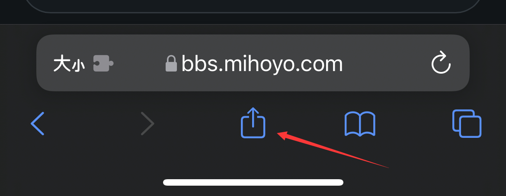
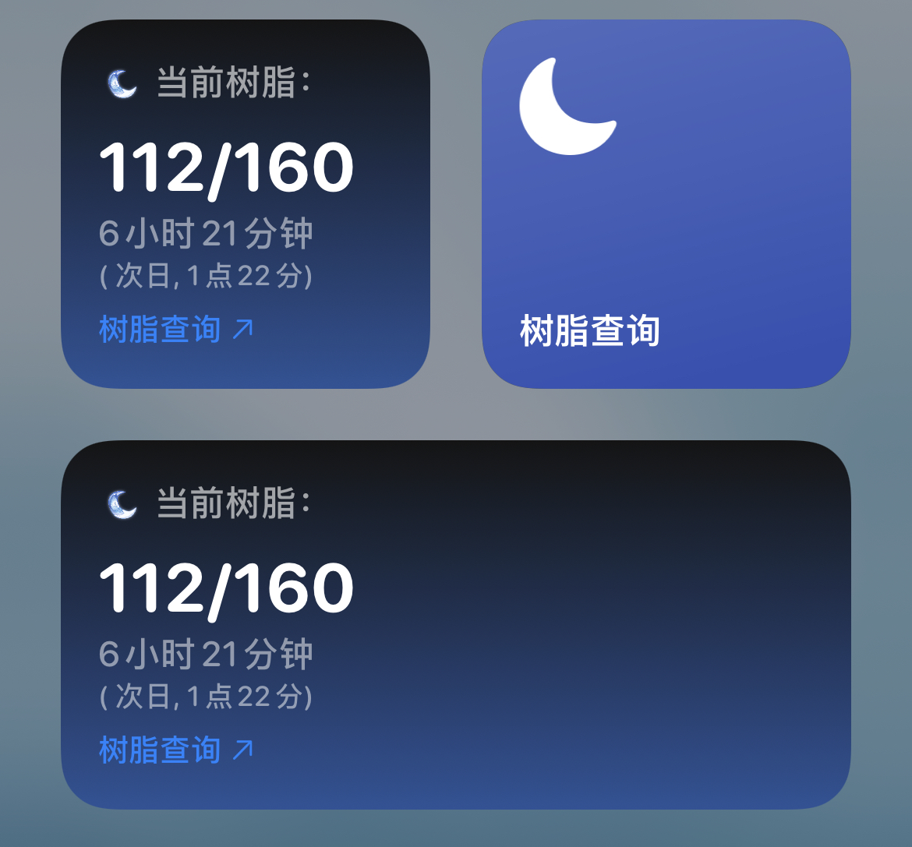

# iOS树脂查询快捷指令 & Scriptable小组件

>**This script is outdated, please consider using the official HoyoLab app widget**
An iOS Shortcut & a widget script for checking Genshin Impact in-game resin status

 

# 安装方法
## 快捷指令

1) 打开 **"AppleID设置 - iCloud云盘"**，打开 **"设置 - 快捷指令 - iCloud同步"** 和 **"高级 - 允许运行脚本"**
2) 添加快捷指令: [安装快捷指令](https://www.icloud.com/shortcuts/5c1d677bd3014fb7a2eaa1965997a078)
3) 用Safari打开并登录: [米游社](https://m.bbs.mihoyo.com/ys)  (iPad请打开移动版网页)
4) *[首次执行] 在米游社网页下，点击Safari浏览器的 **"分享"** 按键 - 点击 **"树脂查询"** (权限全选择始终允许)*
5) 点击树脂查询

## Scriptable小部件

1) App Store下载安装 **"Scriptable"**
2) 添加配置生成快捷指令：[安装快捷指令](https://www.icloud.com/shortcuts/1beb664713a242f68aaf279e4e7b37d1)
3) 执行指令，根据提示进行设置(权限选择允许或始终允许)
4) 添加Scriptable小组件到桌面/负一屏  (推荐大小: 小/中)
5) 长按小组件选择 **"编辑小组件 - Script - Resin"**

