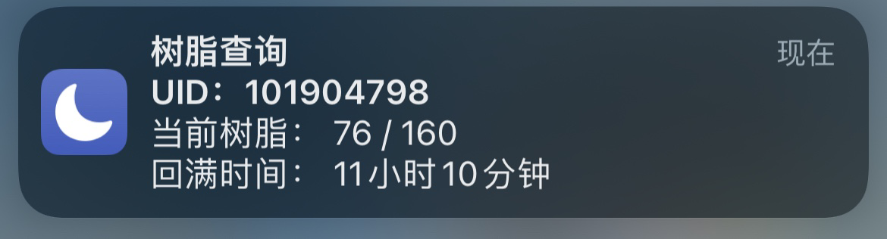
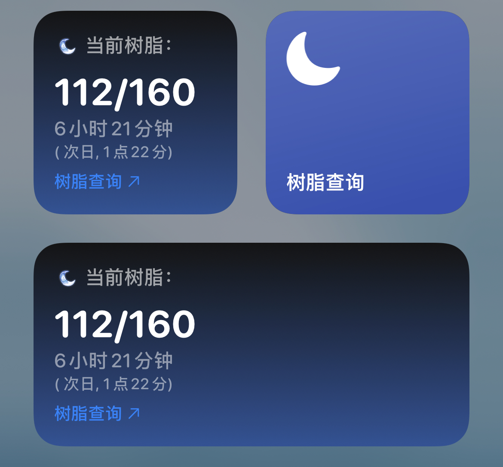

# iOS树脂查询快捷指令

An iOS Shortcuts for checking Genshin Impact in-game resin status

## 使用说明

1) 打开 "AppleID设置-iCloud云盘"，打开 "设置-快捷指令-iCloud同步" 和 "高级-允许运行脚本"
2) 添加快捷指令：https://www.icloud.com/shortcuts/5c1d677bd3014fb7a2eaa1965997a078
3) 用Safari打开并登录[网页版米游社]: [https://m.bbs.mihoyo.com/ys]
4) [首次运行时] 在米游社网页下，点击Safari浏览器的"分享"按键 - 点击"树脂查询" (所有的权限推荐都给允许，和始终允许)
5) [之后]直接点击树脂查询即可(可以在快捷指令里添加快捷方式到Home或者在桌面添加"小部件")

## Scriptable小部件

1) App Store下载安装"Scriptable"
2) 添加配置生成快捷指令：https://www.icloud.com/shortcuts/1beb664713a242f68aaf279e4e7b37d1
3) 运行指令根据提示进行设置(期间权限选允许或始终允许)
4) 桌面或负一屏添加即可(推荐大小：小或中)
